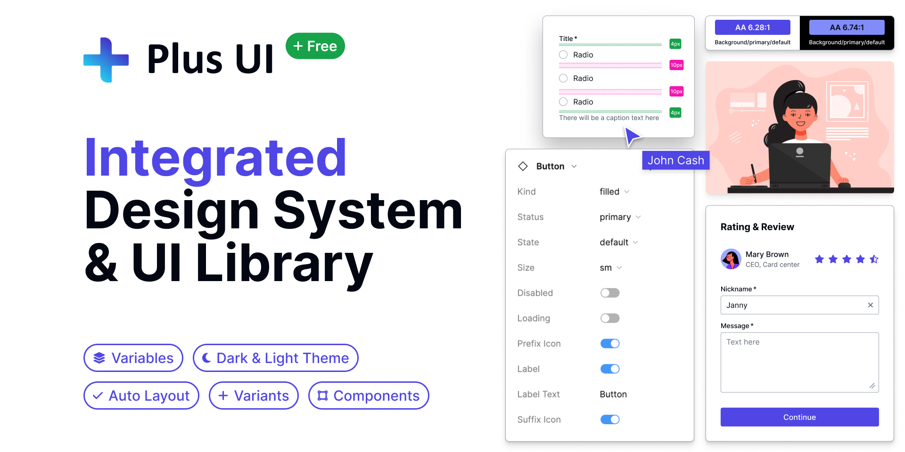

Plus UI is a framework-agnostic library of web components, designed to integrate seamlessly into any project. It empowers developers to build high-quality, consistent, and accessible user interfaces with ease.

## Core Features

- **Centralized Token System**: Bridging the gap between our [Figma Design System](/design-system/overview/) and the UI Library.
- **Rich Component Library**: A comprehensive set of [components](/components/overview/) to build modern applications.
- **Fully Customizable**: Learn how to [theme and customize](/theming/overview/) Plus UI to match your brand.
- **Framework Agnostic**: Works seamlessly with React, Vue, Angular, Svelte, or any other JavaScript framework.

## Where to Start?

- **[Installation](/installation/overview/)**: Get started by adding Plus UI to your project.
- **[Browse Components](/components/overview/)**: Explore the full range of available components.
- **[Design Principles](/foundation/overview/)**: Understand the core ideas that guide our design and development.