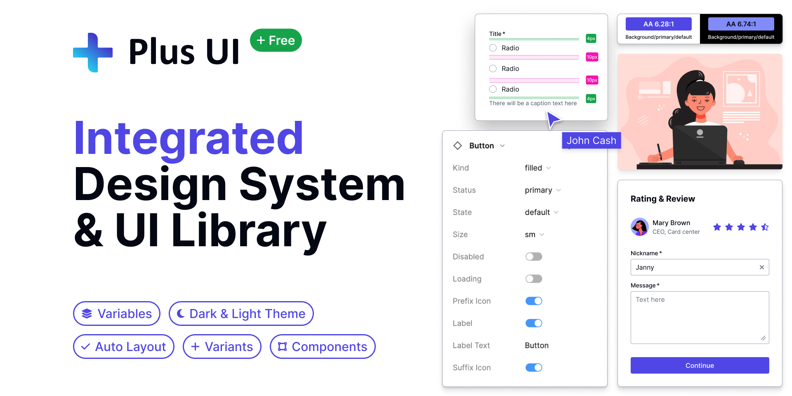

import { CardGrid } from '@astrojs/starlight/components';
import Card from '../../../components/Card.astro';

Plus UI is a new-era user interface and experience product that can be used with all popular frameworks and design tools together.

We offer the full functionality of components that are carefully designed to meet modern design standards and developed to create consistent applications. Developers and designers can work together using a common set of tools and components, resulting in a more streamlined design and development process and consistent, user-friendly products.

  ✓ Centralized Token System that Bridging [Design System](https://www.figma.com/community/file/1310670219738074447/plus-ui-design-system) and [UI Library](/ui-library/overview)
  ✓ Rich and Functional [Components](/getting-started/component-list-and-plans)
  ✓ Fully Customizable and Accessible
  ✓ Light Package Size
  ✓ Open-source
  ✓ Works with [CDNs](/ui-library/overview)
  ✓ Created with Web Component Technology
  ✓ Built with [Lit](https://lit.dev/)
  ✓ Includes a dark theme
  ✓ Integration with Tailwind CSS and Font Awesome
  ✓ [Multi-framework Support](/ui-library/installation) (works wherever HTML works such as [React](/ui-library/installation/react), [Vue](/ui-library/installation/vue), [Angular](/ui-library/installation/angular), [Svelte](/ui-library/installation/svelte) and other JS frameworks)

## Why Plus UI?
- **Save thousands of dollars & hours**: designing and developing a component and its variants, color, size, shape, placement, accessibility, header, cards, data grids, and modals costs thousands of dollars. Instead, Plus UI provides all the foundational components you need and is ready to be customized for your brand. Since it's built on web standards, it works across frameworks and browsers and will continue to be supported for many years. 
- **Ship faster**: We have invested thousands of hours into designing and developing these components so you don't have to. Also, they are fully customizable and compatible with all frameworks. Our unified approach to design and development ensures consistency and speed throughout the process.
- **Integrated Systems**: As a unique in the market, we have a cohesive approach to user interface development where design and development are tightly aligned. It involves combining a comprehensive design system with a set of pre-built UI components into a unified package. This integrated approach aims to ensure consistency, efficiency, and collaboration between designers and developers throughout the entire product development lifecycle.
- **Multi-framework**: Plus UI is a multi-framework library that works with all frameworks such as React, Vue, Angular, Svelte, and other JS frameworks. It ensures consistency and efficiency across different technology stacks.
- **Designer & developer friendly**: Plus UI provides a user-friendly design system and component library that empowers designers and developers to create high-quality interfaces with ease. It prioritizes collaboration, user-centered design, and consistency, offering a range of reusable assets that promote flexibility and seamless integration into existing development workflows.
- **Light package size**: Our component library is fully functional, yet boasts a lightweight package size, even with a wide variety of components and their variants. This combination of functionality and efficiency provides numerous benefits, including improved performance, reduced development time, simplified maintenance, increased compatibility, and lower bandwidth costs.
- **User experience excellence**: Plus UI offers excellent user experience for both end users and project teams through a unified design system and component library, which delivers consistency, efficiency, scalability, accessibility, and branding across all products and services.
- **Technical support**: Our all users get access to technical support from our team and community. Pro users get access to priority support for issues, bug fixes, and feature requests.

## Our Products
Plus UI provides a collection of a professionally designed, highly customizable Design System and a Component Library built on a framework-agnostic technology with functional components.

<CardGrid>
  <Card title="UI Library" icon="open-book">
    Plus UI Component Library is a multi-framework library, powered by a design system that works with all frameworks **React, Vue, Angular, Svelte,** and **other JS frameworks** in a project at the same time
  </Card>
  <Card title="Design System" icon="information">
    Plus UI Design system is a comprehensive design system, powered by an integrated component library that provides guidelines and components for creating visually appealing and consistent user interfaces across different platforms and devices.
  </Card>
</CardGrid>

## Foundations
The foundations of Plus UI guide to creating a consistent, effective, and accessible product that meets the needs of users. It helps designers and developers to work together more efficiently, reducing the risk of inconsistencies, enlightening the principles and patterns, and general solutions for specific problems. Visit the [Foundations](/foundations/overview) section for further information.

## Components
Plus UI components are the reusable and pre-build blocks of our design system to help designers and developers build a modern product faster with an intuitive user experience. You can fully customize our full-function components to match your existing designs to provide a unified experience. Visit the [Components](/components/overview) section for further information.

## Customization
Our fully function components are ready to be customized for your brand. By customizing, you can control the theme, dark/light mode, and general styling. Keep your eye on us, we will launch an advanced customization capability to create your theme soon.

##  Contributing
You can contribute to us in many ways to help more designers and developers worldwide to build apps with excellent experience on the below platforms. Visit [Contributing](/getting-started/contributing) page for further information.

<CardGrid>
  <Card title="Join our Figma Community" icon="heart" href="https://www.figma.com/@plusui">
    Join our Figma community to get the latest updates, share your feedback, and collaborate with other designers and developers.
  </Card>
  <Card title="Follow us on Github" icon="github" href="https://github.com/plus-ui">
    Follow us on Github to get the latest updates, report issues, and contribute to our open-source projects.
  </Card>
  <Card title="Join us on Discord" icon="discord" href="https://discord.gg/QhXfSnze">
    Join us on Discord to get the latest updates, share your feedback, and collaborate with other designers and developers.
  </Card>
  <Card title="Follow us on Twitter" icon="twitter" href="https://twitter.com/PlusUI_Official">
    Follow us on Twitter to get the latest updates, share your feedback, and collaborate with other designers and developers.
  </Card>
  <Card title="Contribute us on Open Collective" icon="openCollective" href="https://opencollective.com/plus-ui">
    Contribute us on Open Collective to get the latest updates, share your feedback, and collaborate with other designers and developers.
  </Card>
</CardGrid>